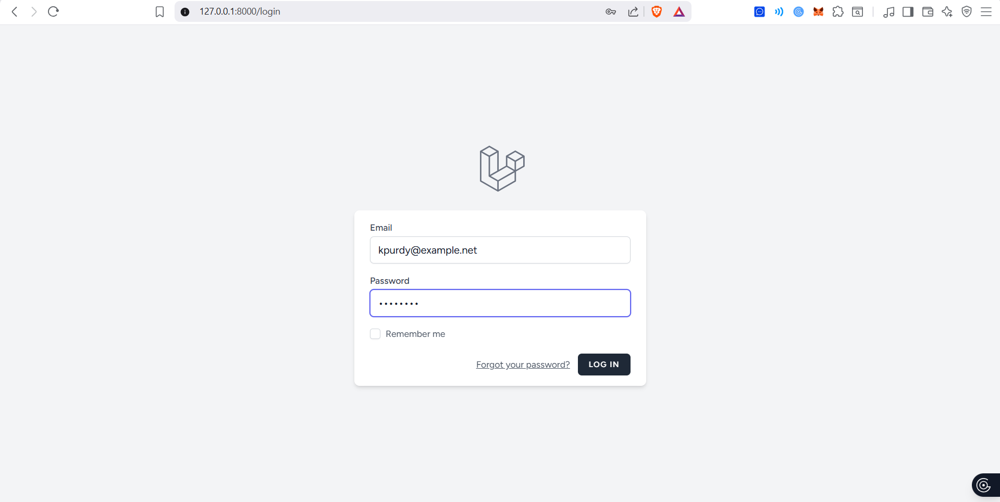
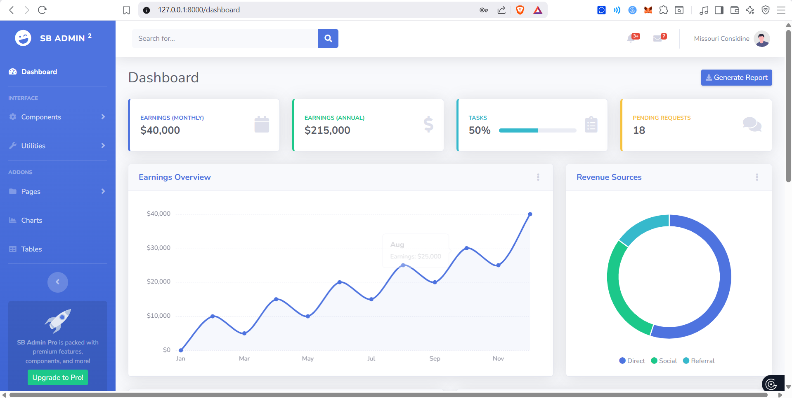

# App Web — Laravel Dashboard

A Laravel 12 web application with user authentication and an SB Admin 2 dashboard.

## Requirements

- PHP 8.2+
- Composer
- Node.js & npm
- MySQL (e.g. XAMPP)

## Setup Instructions

1. **Clone the repository**
   ```bash
   git clone <repository-url>
   cd app-web
   ```

2. **Install PHP dependencies**
   ```bash
   composer install
   ```

3. **Install Node dependencies & build assets**
   ```bash
   npm install
   npm run build
   ```

4. **Environment configuration**
   ```bash
   cp .env.example .env
   php artisan key:generate
   ```
   Then update `.env` with your database credentials:
   ```
   DB_DATABASE=app_web
   DB_USERNAME=root
   DB_PASSWORD=
   ```

5. **Create the database**

   Create a MySQL database named `app_web`.

6. **Run migrations & seed**
   ```bash
   php artisan migrate
   php artisan db:seed
   ```

7. **Start the development server**
   ```bash
   php artisan serve
   ```
   The application will be available at `http://localhost:8000`.

## Screenshots

### Login Page


### Dashboard Page


## Sample Login Credentials

| Name       | Email               | Password   |
|------------|---------------------|------------|
| Admin User | admin@example.com   | password   |

> The seeder also creates 9 additional random users, all with the password `password`.
